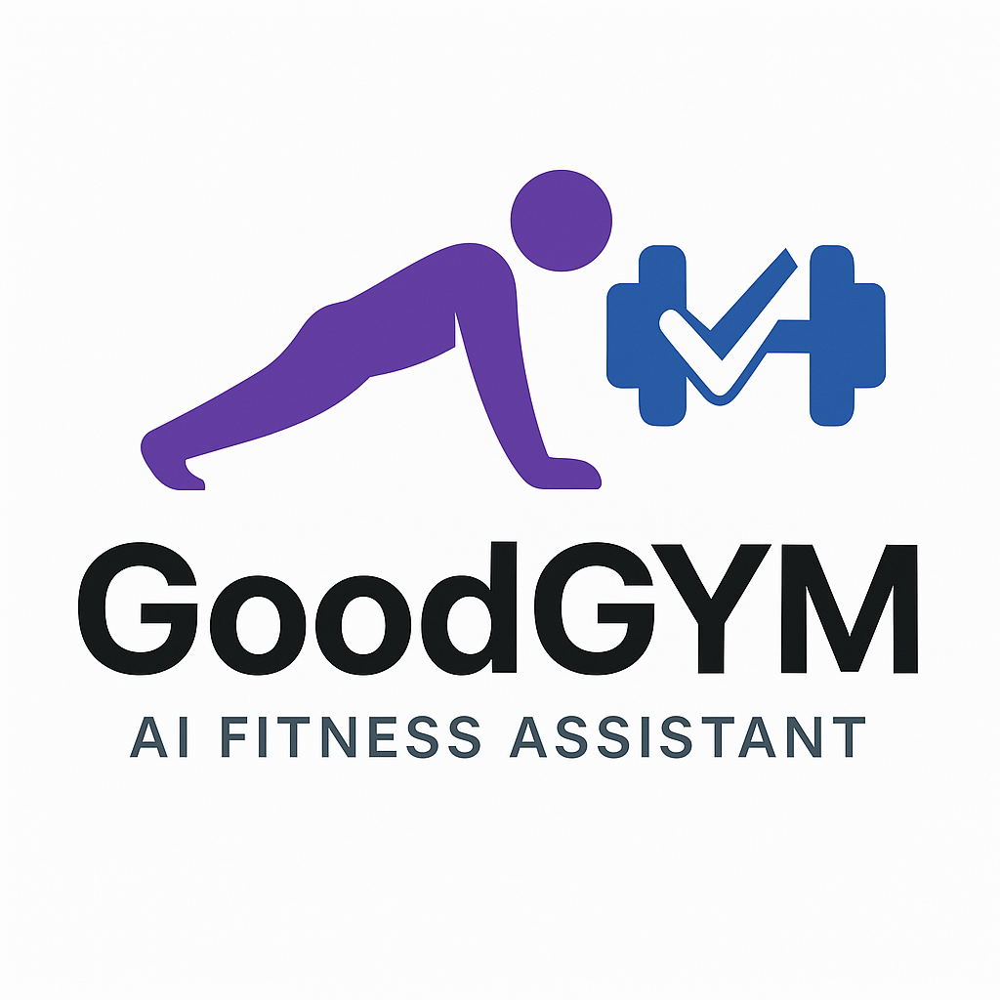

# Good-GYM: AI-Powered Workout Assistant 💪

<div align="center">



[](https://github.com/yo-WASSUP/Good-GYM/stargazers)
[](https://github.com/yo-WASSUP/Good-GYM/network/members)
[](https://github.com/yo-WASSUP/Good-GYM/blob/main/LICENSE)

**Intelligent Fitness Assistant Based on YOLOv11 Pose Detection**

[English](README.md) | [中文](README_CN.md)

</div>

---
 
## 🌟 Features

- **Real-time Exercise Counting** - Automatically counts your repetitions
- **Multiple Exercise Support** - Including squats, push-ups, sit-ups, bicep curls, and many more
- **Advanced Pose Detection** - Powered by YOLOv11 for accurate tracking
- **Visual Feedback** - Live skeleton visualization with angle measurements
- **Workout Statistics** - Track your progress over time
- **User-friendly Interface** - Clean PyQt5 GUI with intuitive controls
- **Works with any webcam** - No special hardware required
- **Runs locally** - Complete privacy

## 📦 Direct Download
- If you don't want to set up a Python environment, you can download our pre-packaged executable:

  **Windows EXE package**: [Baidu Netdisk Link](https://pan.baidu.com/s/your_shared_link) Extraction code: xxxx

## 📋 Requirements

- Python 3.7+
- Webcam
- GPU recommended for better performance (but works on CPU too)

## 🚀 Quick Installation

1. **Clone the repository**
   ```bash
   git clone https://github.com/yo-WASSUP/Good-GYM.git
   cd Good-GYM
   ```

2. **Create and activate virtual environment**
   ```bash
   # Windows
   python -m venv venv
   .\venv\Scripts\activate

   # Linux/MacOS
   python -m venv venv
   source venv/bin/activate
   ```

3. **Install dependencies**
   ```bash
   pip install -r requirements.txt
   ```

4. **Run the application**
   ```bash
   python workout_qt_modular.py
   ```
## 🔧 Advanced Setup

### GPU Version Installation (Recommended)

1. **Ensure your system meets requirements**
   - NVIDIA GPU card (4GB+ VRAM recommended)
   - Latest NVIDIA drivers installed

2. **Install CUDA and cuDNN**
   - Download and install [CUDA Toolkit](https://developer.nvidia.com/cuda-downloads) (version 11.x recommended)
   - Download and install [cuDNN](https://developer.nvidia.com/cudnn)

3. **Clone and install**
   ```bash
   git clone https://github.com/yo-WASSUP/Good-GYM.git
   cd Good-GYM
   
   # Create virtual environment
   python -m venv venv
   # Windows activation
   .\venv\Scripts\activate
   # Linux/MacOS activation
   # source venv/bin/activate
   
   # Install PyTorch with GPU support
   pip install torch torchvision --index-url https://download.pytorch.org/whl/cu118
   
   # Install other dependencies
   pip install -r requirements.txt
   ```

4. **Verify GPU availability**
   ```bash
   python -c "import torch; print('GPU available:', torch.cuda.is_available())"
   ```

5. **Run the application**
   ```bash
   python workout_qt_modular.py
   ```

### Windows Installation (CPU Version)

1. **Install Python and Git**
   - Download and install [Python](https://www.python.org/downloads/) (3.7 or newer)
   - Download and install [Git](https://git-scm.com/download/win)

2. **Clone and install**
   ```powershell
   git clone https://github.com/yo-WASSUP/Good-GYM.git
   cd Good-GYM
   
   # Create virtual environment
   python -m venv venv
   .\venv\Scripts\activate
   
   # Install dependencies
   pip install -r requirements.txt
   ```

3. **Run the application or create executable**
   ```powershell
   # Run directly
   python workout_qt_modular.py
   
   # Or create an executable
   .\build_executable.bat
   ```

### Linux/MacOS Installation

1. **Install dependencies**
   ```bash
   # For Ubuntu/Debian
   sudo apt-get update
   sudo apt-get install python-pip python-dev python-opencv
   
   # For MacOS
   brew install python
   ```

2. **Clone and install**
   ```bash
   git clone https://github.com/yo-WASSUP/Good-GYM.git
   cd Good-GYM
   
   # Create virtual environment
   python -m venv venv
   source venv/bin/activate
   
   # Install dependencies
   pip install -r requirements.txt
   ```

3. **Run the application**
   ```bash
   python workout_qt_modular.py
   ```

## 📝 Usage Guide

### Controls

- Use the interface buttons to select different exercises
- Real-time feedback shows your current form and repetition count
- Press the "Reset" button to reset the counter
- Use manual adjustment buttons to correct the count if needed
- Toggle skeleton visualization on/off
- View your workout statistics over time

### Keyboard Shortcuts

- **S**: Switch to squat counting
- **P**: Switch to push-up counting
- **U**: Switch to sit-up counting
- **B**: Switch to bicep curl counting
- **O**: Switch to overhead press
- **R**: Reset the counter
- **Q**: Quit the application

## 🖼️ Screenshots

 


 


 

## 🤝 Contributing

Contributions are welcome! Please feel free to submit a Pull Request.

## 📄 License

This project is licensed under the MIT License - see the LICENSE file for details.

## 🔮 Future Development

- [ ] Add support for more exercise types
- [ ] Improve pose detection accuracy
- [ ] Add voice feedback
- [ ] Mobile app support
- [ ] Multi-language interface
